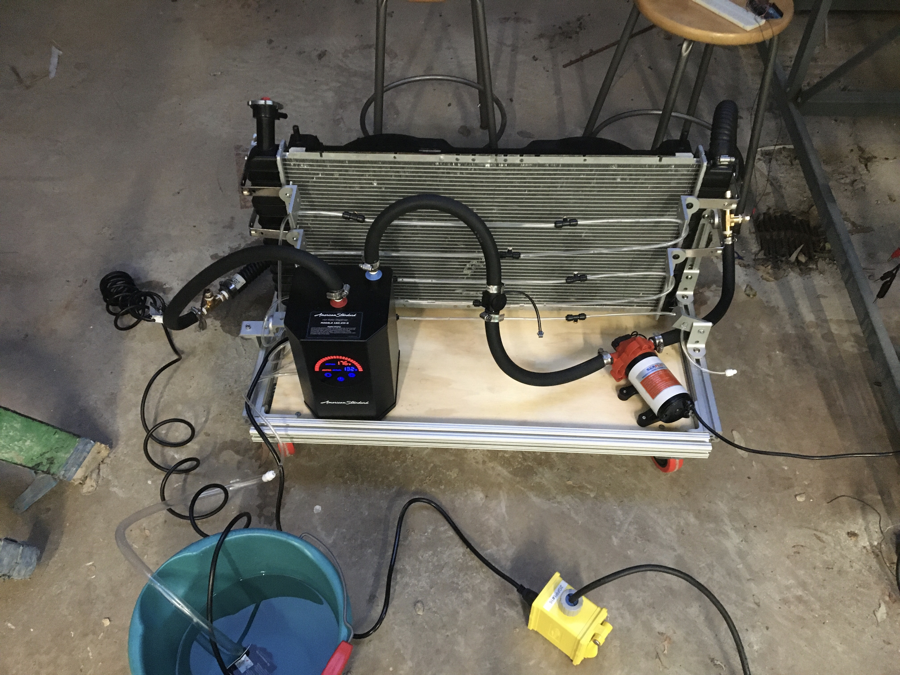

  
  
  

## About Me

Hi! I'm Cedar. Currently, I'm a Masters of Applied Science student in the Electrical and Computer Engineering department at the University of British Columbia. Before that, I attended Harvey Mudd College, where I obtained a double major in Mathematics and Engineering. I have a [resume](https://cturek.github.io/home/resume.html) and a [CV](https://cturek.github.io/home/cv.html).

## Work Experience

I am working with Guy Lemieux at UBC, researching optimization of deep-learning algorithms in FPGAs. 

Previously, I did research with [Professor David Harris](http://pages.hmc.edu/harris/) as a [Clay-Wolkin fellow](https://www.hmc.edu/engineering/engineering-fellowships/clay-wolkin-fellowship/). We designed a RISC-V pipelined processor, and the team is putting the finishing touches on a textbook for teaching courses on the architecture. I coauthored a manuscript on the division and square root module.

I also [graded and tutored for various classes](https://cturek.github.io/home/classes.html) at HMC.

In the past summers, I worked as an intern at [Volpe Pathways](https://www.volpe.dot.gov/about-us/careers/student-and-recent-graduate-opportunities), as a counselor at [MathPath](https://www.mathpath.org/), and as a [backgammon researcher under Professor Arthur Benjamin](https://www.hmc.edu/about/2021/01/11/art-benjamin-is-backgammon-champ/).

## Projects

[Here are some more personal projects I've worked on.](https://cturek.github.io/home/projects.html)

I designed a [Pet Autofeeder](https://cturek.github.io/E155-Autofeeder/) with Manuel Mendoza, which has its own website.

## Classes

I've taken and graded/tutored for a lot of classes. Check out the list [here](https://cturek.github.io/home/classes.html).

For my senior major capstones, I wrote a [math thesis](https://sites.google.com/g.hmc.edu/cturek) on differential topology and lead an engineering clinic with [Sandia National Laboratories](https://www.sandia.gov/) measuring ferroelectric permittivity of barium titanate. We published a paper and I presented our findings at the 2023 APS March Meeting. 

My junior engineering capstone was a clinic with Toyota. We researched, designed, and tested novel methods of improving heat rejection on [fuel cell-powered semi trucks](https://pressroom.toyota.com/the-future-of-zero-emission-trucking-takes-another-leap-forward/). Our final design improved the cooling capacity of the radiator by 20%. 

  

Our testing setup for the semi truck radiator.

## Publications

I contributed to the Floating-Point Chapter in *RISC-V System-on-Chip Design* by Harris, Stine, Thompson, and Harris, to be published by Elsevier, 2024.

I co-wrote *Digit Selection for Recurrence Division and Square Root* by Harris, Stine, Nannarelli, Ercegovac, Parry, and Turek, published in IEEE Transactions on Computers (2023) doi: 10.1109/TC.2023.3305760.

I co-wrote *Analyzing Barium Titanate TiO2 Surface Interactions with tert-Butylphosphonic Acid Using Density Functional Theory* by Marvin, Nicholson, Turek, Iwasa, Pangrekar, Fowler, Van Ginhoven, and Monson, published in [MRS Communications](https://doi.org/10.1557/s43579-023-00425-3) (2023). 

## Hobbies

I play the violin a lot. There are some old videos on my [dad's youtube channel](https://www.youtube.com/@steamboatdad). I also enjoy playing hockey, golf, and tennis, skiing in the winter, and swimming. Otherwise, you will probably find me cooking or playing video games. 

## Contact Information

You can reach me at cedarturek (at) gmail (dot) com or cturek (at) g (dot) hmc (dot) edu. 

My cell is +1 (970) - eight four six - 0531. 
