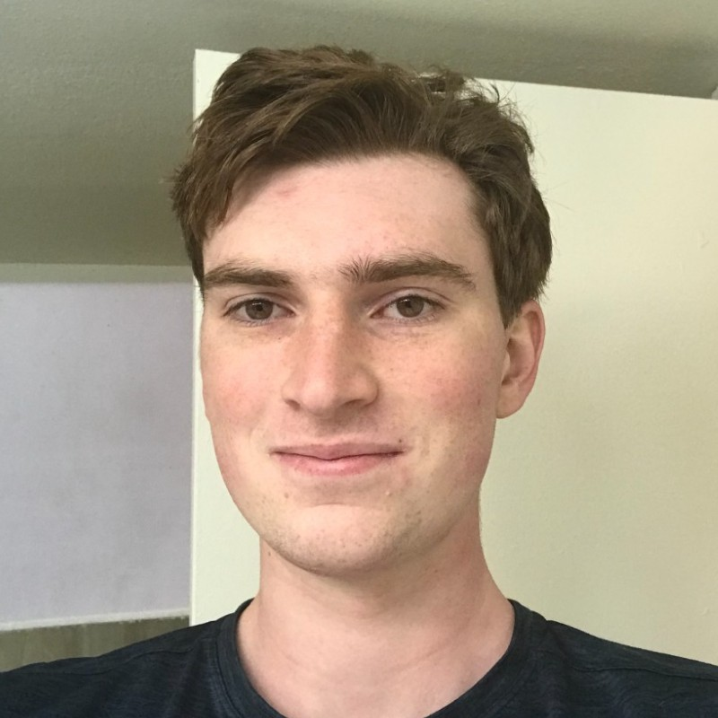

  
  
  

## About Me

Hi! I'm Cedar. Currently, I'm a senior at Harvey Mudd College majoring in math and engineering. Here's my [resume](https://cturek.github.io/home/resume.html).

## Work Experience

I'm currently doing research with [Professor David Harris](http://pages.hmc.edu/harris/) as a [Clay-Wolkin fellow](https://www.hmc.edu/engineering/engineering-fellowships/clay-wolkin-fellowship/). We are designing a RISC-V pipelined processor, and we are writing a textbook for teaching courses on the architecture. I'm coauthoring a paper on the division and square root module (links coming soon).

I also [grade and tutor for various classes](https://cturek.github.io/home/classes.html).

In the past, I worked as an intern at [Volpe Pathways](https://www.volpe.dot.gov/about-us/careers/student-and-recent-graduate-opportunities), as a counselor at [MathPath](https://www.mathpath.org/), and as a [backgammon researcher under Professor Arthur Benjamin](https://www.hmc.edu/about/2021/01/11/art-benjamin-is-backgammon-champ/).

## Projects

[Here are some more personal projects I've worked on.](https://cturek.github.io/home/projects.html)

I designed a [Pet Autofeeder](https://cturek.github.io/E155-Autofeeder/) with Manuel Mendoza, which has its own website.

## Classes

I've taken and graded/tutored for a lot of classes. Check out the list [here](https://cturek.github.io/home/classes.html).

For my senior major capstones, I am writing a [math thesis](https://sites.google.com/g.hmc.edu/cturek) on differential topology and doing an engineering clinic with [Sandia National Laboratories](https://www.sandia.gov/) measuring ferroelectric permittivity of barium titanate. We are writing a paper and will be presenting at the APS March Meeting in 2023. 

My junior engineering capstone was a clinic with Toyota. We researched, designed, and tested novel methods of improving heat rejection on [fuel cell-powered semi trucks](https://pressroom.toyota.com/the-future-of-zero-emission-trucking-takes-another-leap-forward/). Our final design improved the cooling capacity of the radiator by 20%. 

  

Our testing setup for the semi truck radiator.

## Publications

I contributed to the Floating-Point Chapter in *RISC-V System-on-Chip Design* by Harris, Stine, Thompson, and Harris, to be published by Elsevier, 2024.

I co-wrote *Digit Selection for Recurrence Division and Square Root* by Harris, Stine, Nannarelli, Ercegovac, Parry, and Turek (link coming soon).

I am going to co-write a paper on a combined integer and floating point division, remainder, and square root module this spring.

## Violin

I play the violin a lot. There are some old videos on my [dad's youtube channel](https://www.youtube.com/@steamboatdad).

## Contact Information

You can reach me at cedarturek (at) gmail (dot) com or cturek (at) g (dot) hmc (dot) edu. 

My cell is +1 (970) - eight four six - 0531. 