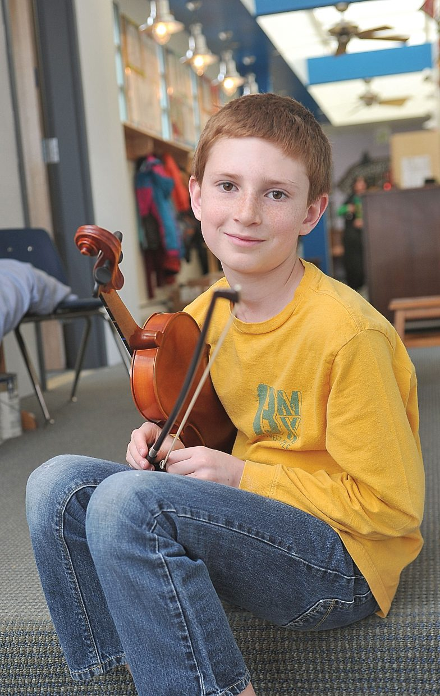
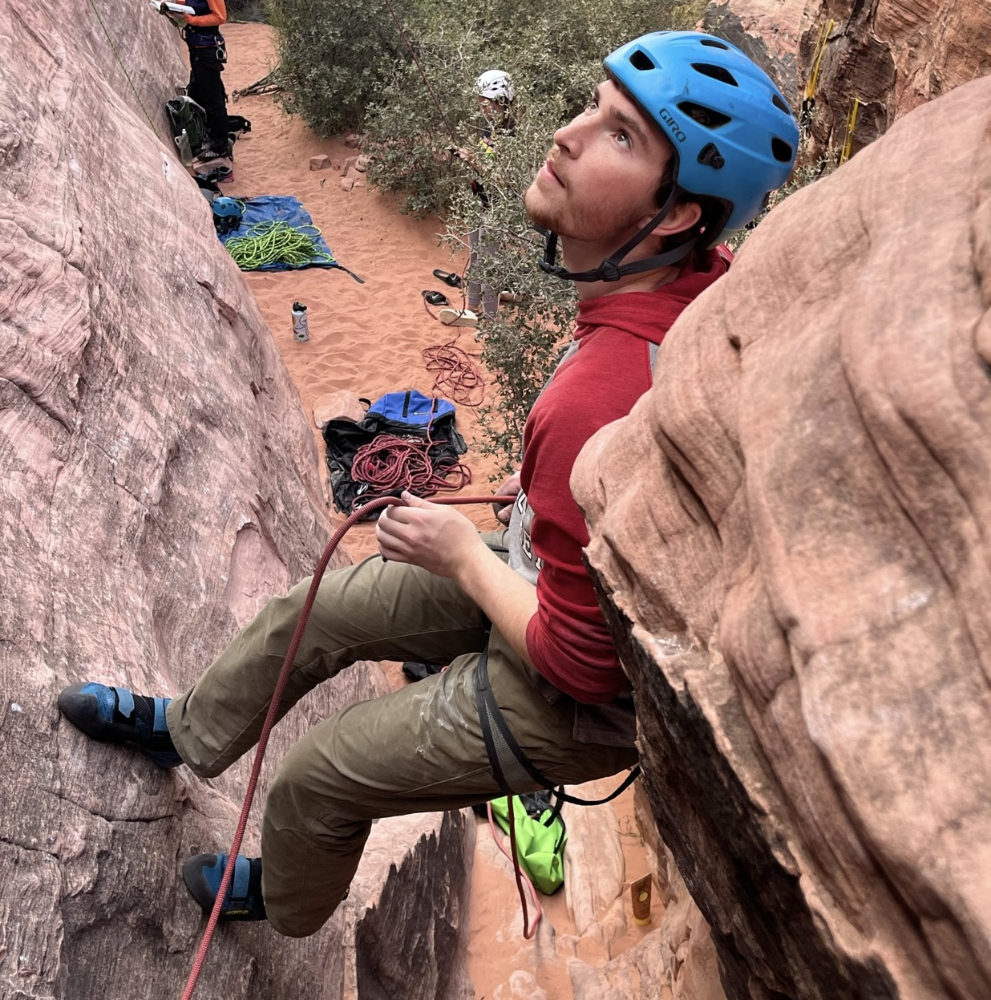

<meta name="description"
content="This is the homepage of Cedar Turek.">

  
  
  

## About Me

Hi! I'm Cedar. Currently, I'm a Masters of Applied Science student in the Electrical and Computer Engineering department at the University of British Columbia. Before that, I attended Harvey Mudd College, where I got a double major in Mathematics and Engineering. I have a [resume](https://cturek.github.io/home/resume.html) and a [CV](https://cturek.github.io/home/cv.html).

## Work Experience

I am working with [Guy Lemieux](https://people.ece.ubc.ca/~lemieux/) and [Frank Wood](https://www.cs.ubc.ca/~fwood/) at UBC, researching novel techniques in analog hardware acceleration for machine learning.

Previously, I did research with [David Harris](http://pages.hmc.edu/harris/) as a [Clay-Wolkin fellow](https://www.hmc.edu/engineering/engineering-fellowships/clay-wolkin-fellowship/). We designed a [RISC-V pipelined processor](https://github.com/openhwgroup/cvw), and the team is putting the finishing touches on a textbook for teaching courses on the architecture. I coauthored a couple manuscripts on the division and square root module.

I also [graded and tutored for various classes](https://cturek.github.io/home/classes.html) at HMC.

In the past summers, I worked as a junior faculty at [HCSSiM](https://hcssim.org/), an intern at [Volpe Pathways](https://www.volpe.dot.gov/about-us/careers/student-and-recent-graduate-opportunities), a counselor at [MathPath](https://www.mathpath.org/), and a [backgammon researcher under Professor Arthur Benjamin](https://www.hmc.edu/about/2021/01/11/art-benjamin-is-backgammon-champ/).

## Projects

[Here are some more personal projects I've worked on.](https://cturek.github.io/home/projects.html)

I designed a [Pet Autofeeder](https://cturek.github.io/E155-Autofeeder/), which has its own website.

## Classes

I've taken and graded/tutored for a lot of classes. Check out the list [here](https://cturek.github.io/home/classes.html).

For my senior major capstones, I wrote a [math thesis](https://sites.google.com/g.hmc.edu/cturek) on differential topology and lead an engineering clinic with [Sandia National Laboratories](https://www.sandia.gov/) measuring ferroelectric permittivity of barium titanate. We published a paper and I presented our findings at the 2023 APS March Meeting. 

My junior engineering capstone was a clinic with Toyota. We researched, designed, and tested novel methods of improving heat rejection on [fuel cell-powered semi trucks](https://pressroom.toyota.com/the-future-of-zero-emission-trucking-takes-another-leap-forward/). Our final design improved the cooling capacity of the radiator by 20%. 

  

Our testing setup for the semi truck radiator.

## Publications

I contributed to the Floating-Point Chapter in *RISC-V System-on-Chip Design* by David Money Harris, James Stine, Rose Thompson, and Sarah L. Harris, to be published by Elsevier, 2024.

I co-wrote *Digit Selection for Recurrence Division and Square Root* with David Money Harris, James Stine, Alberto Nannarelli, Miloš Ercegovac, and Katherine Parry, published in IEEE Transactions on Computers (2023) doi: 10.1109/TC.2023.3305760.

I co-wrote *Analyzing Barium Titanate TiO2 Surface Interactions with tert-Butylphosphonic Acid Using Density Functional Theory* with Jessica Marvin, James Nicholson, Erina Iwasa, Nilay Pangrekar, Whitney Fowler, Renee Van Ginhoven, and Todd Monson, published in [MRS Communications](https://doi.org/10.1557/s43579-023-00425-3) (2023). 

I co-wrote *Shared Recurrence Floating-Point Divide/Sqrt and Integer Divide/Remainder with Early Termination* with Kevin Kim, Katherine Parry, David Money Harris, Ale Maiuolo, Rose Thompson, and James Stine, to be published this year in IEEE Transactions on Computers.

## Hobbies

I play the violin a lot. There are some old videos on my [dad's youtube channel](https://www.youtube.com/@steamboatdad). I also enjoy playing hockey, golf, and tennis, skiing in the winter, and swimming. Otherwise, you will probably find me cooking or playing video games. 

## [Contact Information: Click Here!](https://cturek.github.io/home/contact.html)
