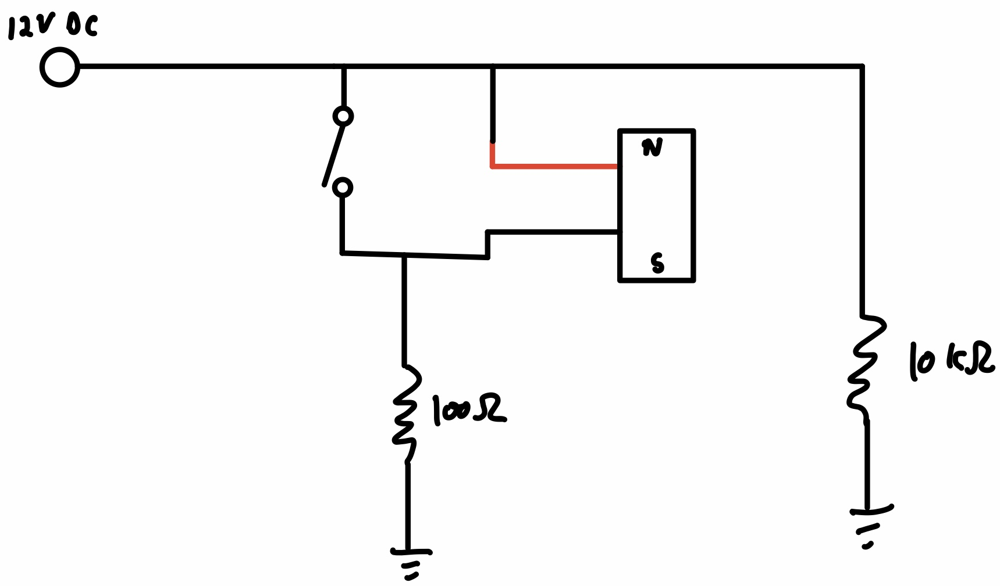
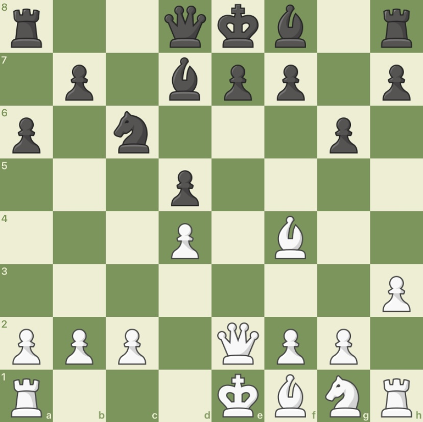
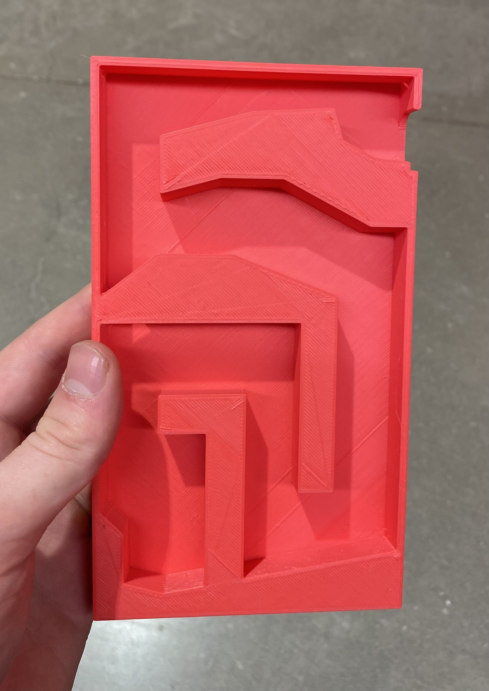

I have done some projects for classes and, more recently, for clubs.

## E155: Microprocessors

Manuel Mendoza and I made a configurable, fully functional pet autofeeder. It is super awesome. 

We made a [website](https://cturek.github.io/E155-Autofeeder/) about it, please check it out!

## E178: Rocketry

Manuel Mendoza and I constructed a modified 2.2" diameter Adventurer rocket. We ran it on a 

## E80: Experimental Engineering

## MuddEscapes

MuddEscapes is the escape room building club at Harvey Mudd. I joined in the Fall 2022 semester, and I've made two puzzles.

# 1. Physical Chess Puzzle

I like to do chess puzzles, and I thought that a real-life one might fit in with the theme of the escape room (haunted library). For construction, I drilled a hole in the top of a nightstand with a drawer to thread a reed switch through. These switches become shorted in the presence of a magnetic field, so I placed a magnet in the bottom of a chess knight. Then I hooked up the switch to an electromagnet, such that the electromagnet would disable when the knight was placed correctly.

  

Figure 1. Electromagnet and Reed Switch Schematic.

  

Figure 2. Chess Puzzle.

See if you can figure out where to place white's other knight.

# 2. Magnet Maze

My other puzzle was a 3D-printed maze housed in a book. The solver would use a piece of iron to guide a magnet contained in the book to an opening in the top. The cover was placed over the maze so the solver wouldn't be able to see the path, but it was simple enough that most people got it after the fifth try or so.

I placed a couple of openings and angled the puzzle such that if the solver dropped the magnet, it would naturally drop down to the bottom left starting zone.

The solidworks files of the maze are available [on github](https://github.com/cturek/home).

  

Figure 3. Magnet Maze (Thumb for Scale.)

Visible text screen readers should ignore

Hidden text screen readers should also ignore

